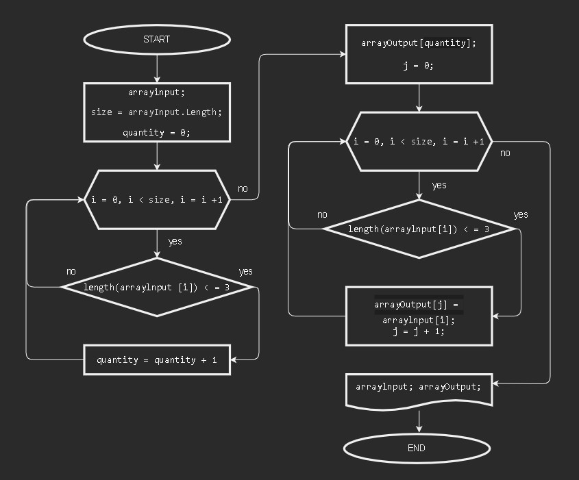
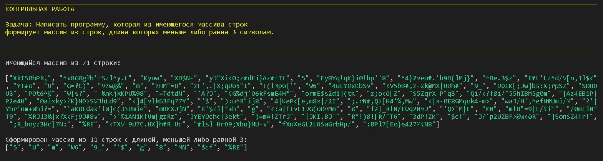
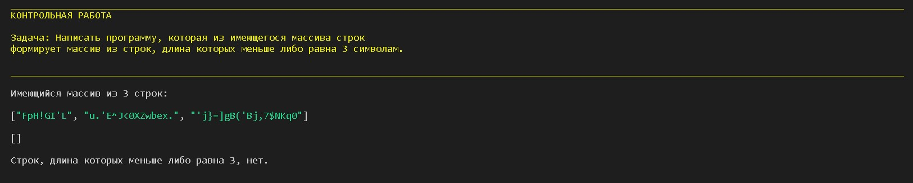

Выполнил Антон 

 11.08.2022

"Данная работа необходима для проверки ваших знаний и навыков по итогу прохождения первого блока обучения на программе разработчик.
Мы должны убедиться что базовое знакомство с it прошло успешно.
Задача алгоритмически не самая сложная, однако для полненного выполнения проверочной работы необходимо:

1. Создать репозиторий на GitHub
2. Нарисовать блок-схему алгоритма (можно обойтись блок-схемой основной содержательной части, если вы выделяете ее в отдельный метод)
3. Снабдить репозиторий оформленным текстовым описанием решения (файл README.md)
4. Написать программу, решающую поставленную задачу
5. Использовать контроль версий в работе над этим небольшим проектом
(не должно быть так что все залито одним коммитом, как минимум этапы 2, 3 и 4 должны быть расположены в разных коммитах".

## ЗАДАЧА:
Написать программу, которая из имеющегося массива строк формирует массив из строк, длина которых меньше либо равна 3 символа.

Первоначальный массив можно ввести с клавиатуры, либо задать на старте выполнения алгоритма.
При решении не рекомендуется пользоваться коллекциями, лучше обойтись исключительно массивами.

### ПРИМЕРЫ:
["hello”, "2", "world”,-> ["2”]
["1234”, ”1567", ”-2”, "computer science"] -> ["-2"]
["Russia”, "Denmark", "Kazan"] -> []

..............................................................

## ДЕКОМПОЗИЦИЯ ЗАДАЧИ:

* создать массив строк arrayInput,
* подсчитать quantity элементов - строк, длина которых меньше либо равна 3,
* задать массив, количество элементов которого равно quantity,
* заполнить заданный массив строками из первого массива, длина которых меньше либо равна 3,
* ввывести полученный массив.

..............................................................

## БЛОК-СХЕМА:

..............................................................

**Примеры вывода:**

 

